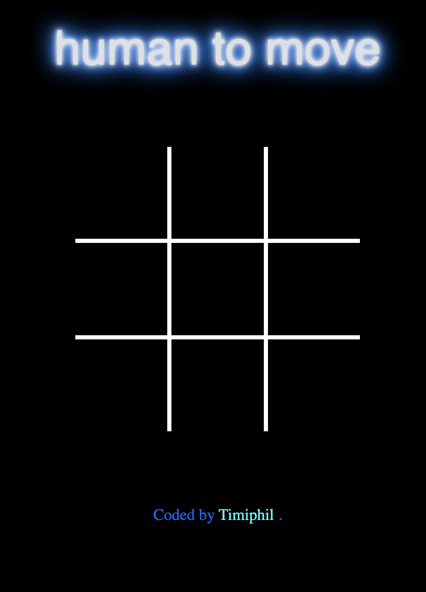
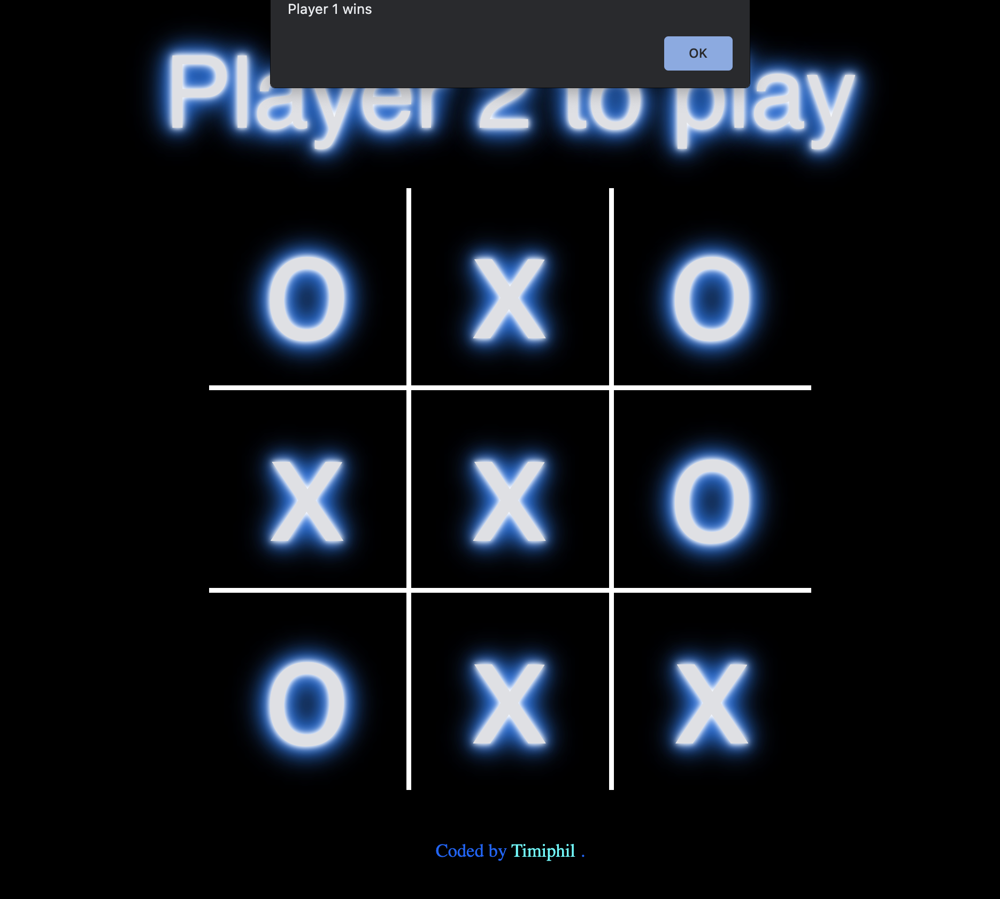

# Tic-Tac-Toe-Game

  

  
  

Building a Tic-tac-toe game for human to human and AI to human. This is Two-player turn-based games that is used in Chess, Backgammon, and Mancala, where Two players plays against each other until one of them wins. 

This game is build on **Minimax** algorithm that is used in decision making and game theory. The minimax algorithm checks all the possible combinations from a given position. Then it chooses the best possible move that maximizes the chances of winning, assuming that both players play optimally.

some of the challenges that I encounter when builiding this game are the runtime of thge AI, as the algorithm is recursive and the number of executions may become huge. Considering a chess game, If we were to write the number of combinations, the entire universe would not be enough. I hope to implement the use of a dictionary which allows searching in counting for storing values. Using this approach can reduce the time complexity.

---

# How to play 

Tic-tac-toe is a fun game that you can play any time and anywhere. Two players play against each other, turn after turn. When the first player goes with "X", you can allow the first player to decide whether to go with "X"s or to go with "O"s. These symbols will be clicked on the table, in an attempt to have three of them in a row. If you're going first, then the best move you can make is to move into the center. This will maximize your chances of winning since you'll be able to create a row of three "X"s or "O"s in more combinations, this way than if you chose a different square.

Have the second player go second. After the first player has finished, the second player should put down his symbol, which will be distinct from the first player's symbol. The second player has the option of attempting to prevent the first player from forming a row of three or concentrating on forming their own row of three. If possible, the player can perform both.

  

Continue exchanging actions until one player draws a row of three symbols, or until there is no winner. Tic-tac-toe is won by the first player to draw three of their symbols consecutively, whether they are drawn in a horizontal, vertical, or diagonal pattern. However, if both players play according to their best course of action, there is a significant likelihood that no one will succeed because you will have eliminated all of your opponents' chances to form a row of three.

---

## Links

[Link to Portfolio Website](https://timiphil.github.io/MyPortfolio/)

[Link to Play Tic-Tac-Toe-Game](https://timiphil.github.io/Tic-Tac-Toe-Game/)

---
## Labels

---
# Conclusion
I have learnt about the __minimax__ algorithm, its mechanism, limitations, and looking forward on how to improve it, building and customizing other various games. 

